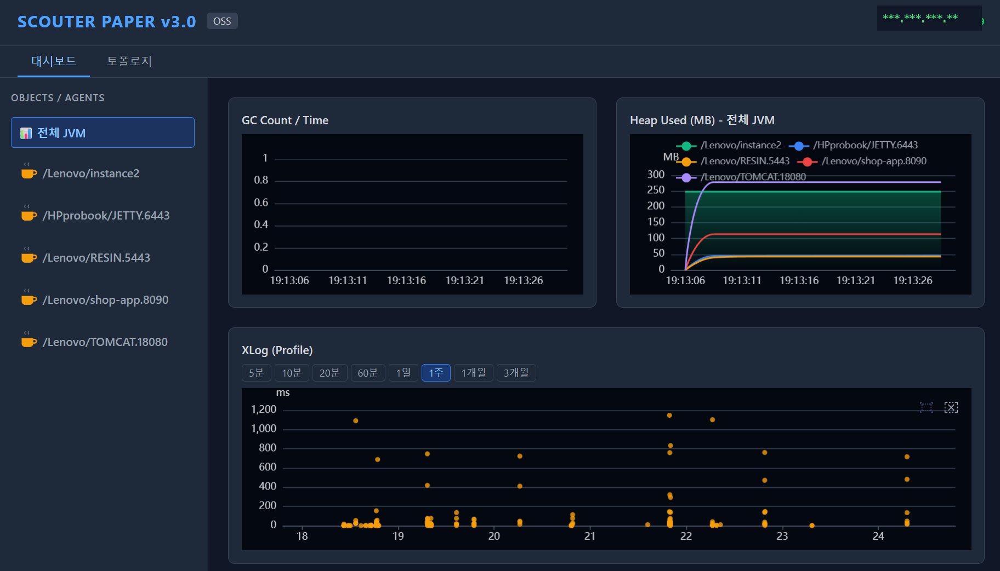
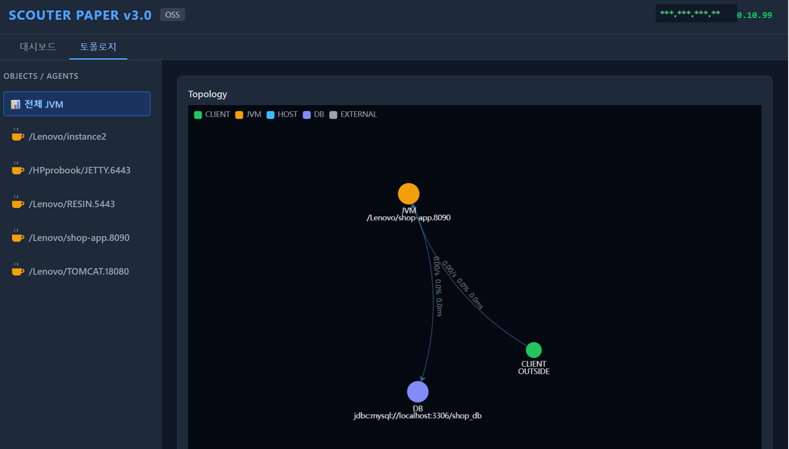

# Scouter Paper v3

Scouter APM을 위한 커스텀 대시보드 (React + TypeScript + ECharts)

🔗 [datagrid.co.kr](https://datagrid.co.kr) · [datagraphy.io.kr](https://datagraphy.io.kr)

> 이 프로젝트는 [Scouter](https://github.com/scouter-project/scouter) (Apache 2.0)의 HTTP Web API를 사용하는 별개의 커뮤니티 대시보드이며, 공식 Scouter 프로젝트와는 무관합니다.

## Features
- 실시간 JVM Heap / GC 모니터링
- XLog(Profile) 트랜잭션 추적, 드래그 다중 선택
- 서비스 간 호출 토폴로지 그래프 (force-directed)
- 대시보드 / 토폴로지 탭 전환

## Setup

```bash
git clone https://github.com/kmw7117-dev/scouter-paper-v3.git
cd scouter-paper-v3
npm install
cp .env.example .env
# .env에서 VITE_SCOUTER_SERVER_URL을 자신의 Scouter Collector 주소로 수정
npm run dev
```

## Requirements
- Node.js 18+
- Scouter Server (Collector) with HTTP API enabled

## Screenshots




## Feedback

버그 제보나 기능 요청은 [Issues](https://github.com/kmw7117-dev/scouter-paper-v3/issues)에 남겨주세요.

## License

MIT
